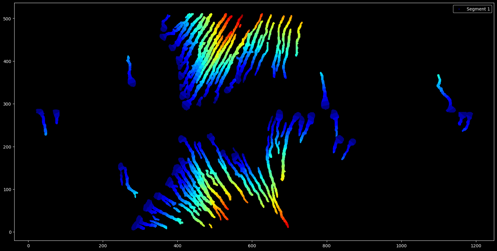
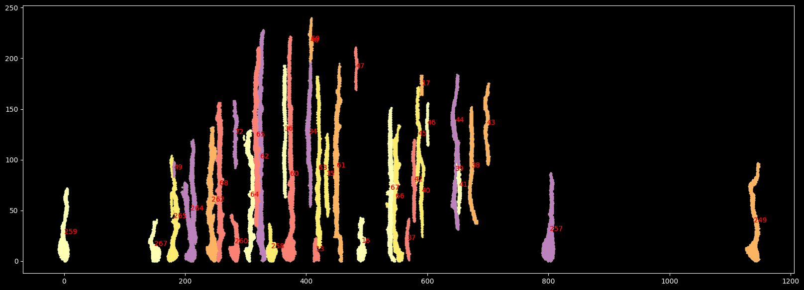
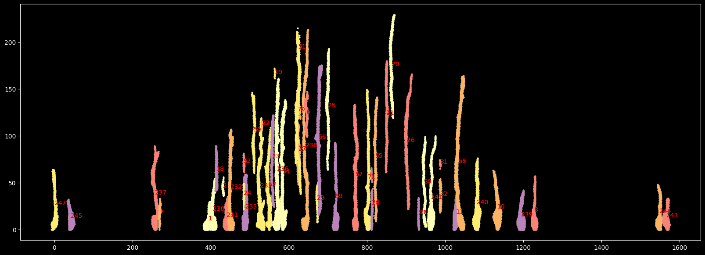

# silver-dollop
This repo contains analysis tools for astroglial cells 

<!-- @import "[TOC]" {cmd="toc" depthFrom=1 depthTo=6 orderedList=false} -->

<!-- code_chunk_output -->
- [Overview](#overview)
- [Getting Started](#getting-started)
  - [Prerequisites](#prerequisites)
  - [Setup either via quick setup or local source code clone setup](#setup-either-via-quick-setup-or-local-source-code-clone-setup)
    - [Quick setup](#quick-setup)
    - [Local source code clone setup and package installation](#local-source-code-clone-setup-and-package-installation)
  - [Usage](#usage)


# Overview









**You can check out the** [notebook](src/astroglial_analysis/notebook.ipynb) **for more details.**

# Getting Started

This project is managed by Poetry, but you can also set it up using Anaconda. Follow the steps below to get started:

## Prerequisites

- [Anaconda](https://www.anaconda.com/products/distribution) installed on your system.

## Setup either via [Quick setup](#quick-setup) or [Local source code clone setup and package installation](#local-source-code-clone-setup-and-package-installation)

### Quick setup (recommended)

1. **download the environment.yaml file:**

    Downdload the `environment.yaml` file from the repository in your local machine.

2. **Create a new Anaconda environment:**

    open the terminal and change the directory to the location of the `environment.yaml` file and run the following commands:
    ```sh
    conda env create -f environment.yaml
    conda activate astroglial_analysis
    ```
3. **Install the package:**

    ```sh
    pip install git+https://github.com/yaksilab/silver-dollop.git
    ```
You are all set to use the package. checkout the [Usage](#usage) section for more details.

---
### Local source code clone setup and package installation

1. **Clone the repository:**

    ```sh
    git clone https://github.com/yaksilab/silver-dollop.git
    cd silver-dollop
    ```

2. **Create a new Anaconda environment:**

    ```sh
    conda env create -f environment.yaml
    conda activate astroglial_analysis
    ```

3. **Install dependencies:**

    ```sh
    pip install -r requirements.txt
    ```
4. **Install the package:**

    ```sh
    pip install -e .
    ```
## Usage

You can use the package by importing it in your python script or jupyter notebook or running the main script as follows:

### 
Run the main script with the following command:

1. **Activate the environment:**

    ```sh
    conda activate astroglial_analysis
    ```
2. **Run the main script:**

    ```sh
    python -m astroglial_analysis <path to your data folder>
    ```
3. **Run with additional arguments:**

    ```sh
    python -m astroglial_analysis <path to your data folder> --segment_length 12
    ```
### import the package in your python script or jupyter notebook:

1. **Activate the environment:**

    ```sh
    conda activate astroglial_analysis
    ```
2. **Import the package:**

    ```python
    from astroglial_analysis.run_pipline import run_pipeline

    run_pipline('<path to your data folder>', segment_length=12)
    ```


